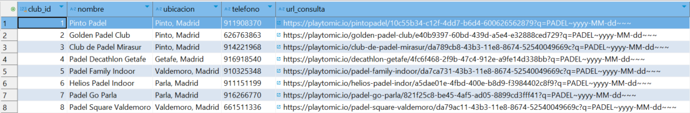
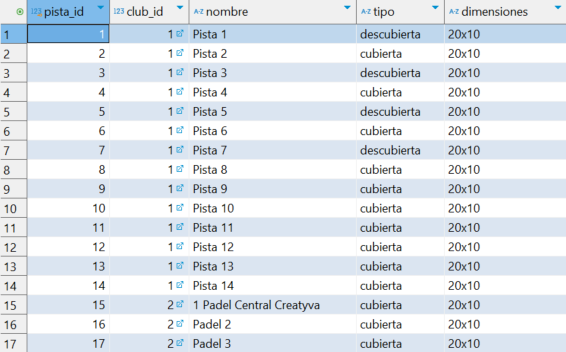
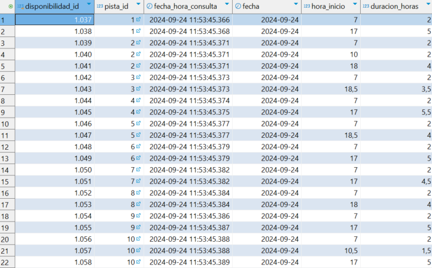

# Padel Court Demand Analyzer in Playtomic

### Overview

The **demand-paddle** database is designed to manage and analyze the availability of padel courts across various clubs. It consists of three main tables that store essential information for processing court availability requests.

### Database Structure

1. **CLUB Table**:
   - **ID**: Unique identifier for each club.
   - **Name**: The name of the club.
   - **Location**: The geographical location of the club.
   - **Phone**: Contact number for the club.
   - **Playtomic URL**: A base URL used to query availability data on Playtomic. This URL will later be appended with the specific date (day, month, year) for which availability is being checked.

   


2. **PISTA Table**:
   - **ID**: Unique identifier for each court.
   - **Club ID**: References the corresponding club in the CLUB table.
   - **Name**: The name assigned to the court by the club.
   - **Type**: Indicates whether the court is indoor (covered) or outdoor (uncovered), which allows for various analyses.
   - **Dimensions**: Provides the dimensions of the court, facilitating further analytical processes.

   

3. **DISPONIBILIDAD Table**:
   - **ID**: Unique identifier for each availability record.
   - **Court ID**: References the specific court in the PISTA table.
   - **Query Date and Time**: The date and time at which the availability is checked.
   - **Reservation Date**: The specific date for which availability is being queried.
   - **Start Time**: The time at which a reservation can begin.
   - **Duration**: Duration of the reservation in hours, extracted from Playtomic's data.

   

### Functionality

This database structure enables efficient querying and management of padel court availability across different clubs. By leveraging the Playtomic API, the system retrieves and stores real-time availability data, allowing users to analyze trends and make informed decisions about court usage.


## Description

This project aims to analyze the demand for padel courts in clubs on the Playtomic platform. It uses Selenium to automate the collection of data regarding court availability, storing the information in a PostgreSQL database.

## Requirements

Before running the project, ensure you have the following components installed:

- Python 3.x
- PostgreSQL
- Chrome and ChromeDriver (compatible with the installed version of Chrome)

## Installation

1. **Clone the repository**:

   ```bash
   git clone https://github.com/your_username/padel-court-demand-analyzer.git
   cd padel-court-demand-analyzer

2. **Clone the repository**:

    Install the necessary dependencies: Make sure you have selenium and psycopg2 installed. You can install them using pip:

    ```bash
    pip install selenium psycopg2

2. **Set up the database**:

    Create a PostgreSQL database named demanda_padel, and ensure you have the necessary tables (Club, pista, and Disponibilidad) configured according to your needs:

    ```bash
    pip install selenium psycopg2

## Usage

1. **Configure the Script**:
   - Adjust the path to `chromedriver` in the Python script. Locate the line:
     ```python
     chrome_driver_path = "C:\\chromedriver\\chromedriver.exe"
     ```
     Change it to the correct path where your `chromedriver.exe` is located.

   - Configure the database connection parameters in the script. Update the following values with your PostgreSQL credentials:
     ```python
     conn = psycopg2.connect(
         dbname='demanda_padel',
         user='your_username',
         password='your_password',
         host='localhost',
         port='5432'
     )
     ```

2. **Run the Script**:
   - Open your terminal or command prompt.
   - Navigate to the directory where the script is located.
   - Execute the script with the following command:
     ```bash
     python script.py
     ```
   - The script will start collecting data on court availability for the next 15 days for each club defined in your database. The results will be logged and stored in the PostgreSQL database.

3. **Check Logs**:
   - Logs of the script's execution will be stored in the `logs` directory specified in the script. Each log file will have a timestamp in its filename.
   - Review the log files to monitor the data collection process and any issues that may arise.

4. **Verify Database Entries**:
   - After running the script, check your PostgreSQL database to ensure that the availability data has been correctly inserted into the `Disponibilidad` table.
